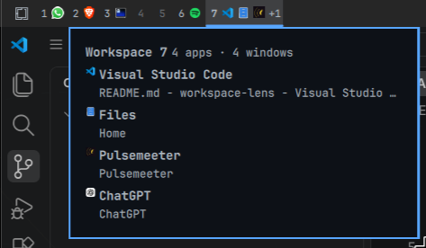

# Workspace Lens

Workspace Lens is an Omarchy Shell widget that makes applications in each
Hyprland workspace visible directly from the bar.



## Requirements

- Omarchy 4
- Quickshell 0.3
- Hyprland

## Installation

Install and enable the public plugin with:

```bash
omarchy plugin add https://github.com/JacobsenNando/workspace-lens.git --enable
```

From a checkout of this repository, install the plugin into your user plugin
directory with:

```bash
bash scripts/install.sh
```

The installer writes only to
`~/.config/omarchy/plugins/jacobsennando.workspace-lens` (or the isolated
`WORKSPACE_LENS_INSTALL_ROOT` used by tests). It safely replaces a previous
Workspace Lens installation, but refuses to overwrite an unknown plugin.

Activation rescans Omarchy Shell plugins and enables Workspace Lens. Its
manifest metadata declares that it replaces `omarchy.workspaces`, so Omarchy
uses Workspace Lens in place of the built-in workspace widget.

## Experience

- Each workspace shows up to three grouped application icons and a `+N`
  overflow indicator.
- Group badges show the number of windows for an application.
- Hovering for 180 ms opens a contextual panel; it closes after 220 ms.
- The panel is informational and lists the applications and windows without
  changing native workspace switching.

## Development

Run the automated checks with:

```bash
node --test tests/*.test.mjs && bash tests/install.test.sh
```

To remove the plugin safely, disable it first, then remove only its exact user
plugin directory:

```bash
omarchy plugin disable jacobsennando.workspace-lens
rm -rf ~/.config/omarchy/plugins/jacobsennando.workspace-lens
```

## Status

Implemented, with automated installer and model checks. The WhatsApp and
Discord web-app icons were visually verified after restarting Omarchy Shell.
The approved direction is in the [design specification](docs/superpowers/specs/2026-08-18-workspace-lens-design.md).
